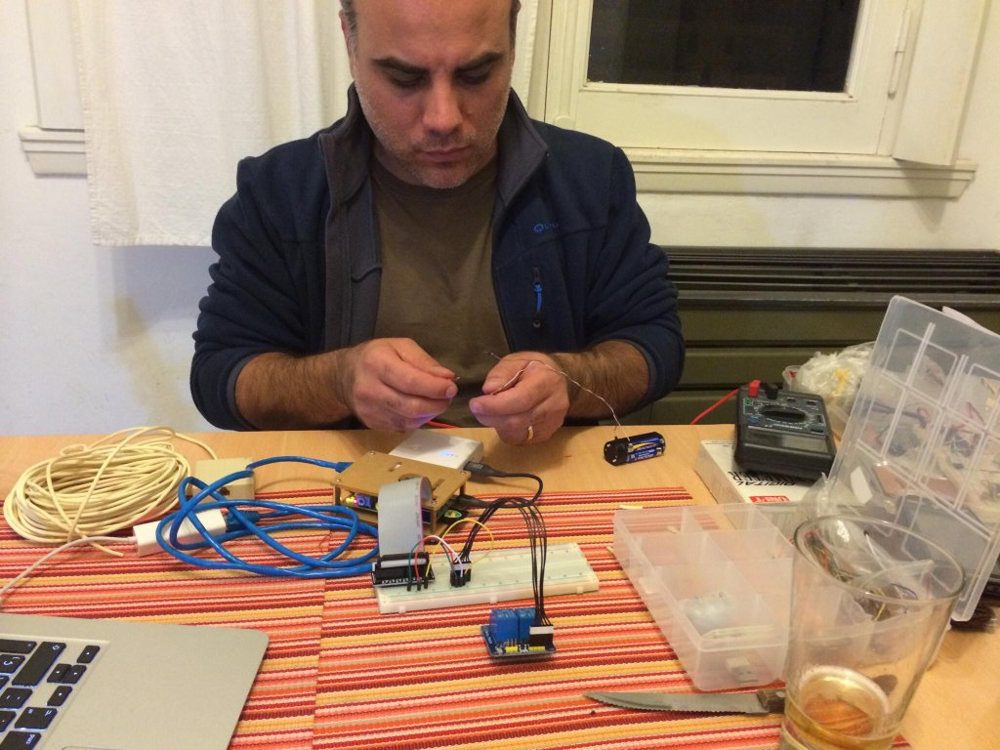

Somewhere around 2013 I came across an article covering the possibilities offered by a novel _mini-computer_. Little did I know, this unassuming device - created in England for a scholarship program - was about to set off a small revolution of its own, all under the curious name of **Raspberry Pi**.

Driven by an interest in the device’s capabilities as a Media Center, I bought my first Raspberry Pi, a model B, shortly after reading the article. Initially, the goal was to gain access to my entire movie and TV library through a nice interface, so I began by installing the Media Center (first [RaspBMC](https://osmc.tv/), next changed to [XBian](http://www.xbian.org/)) and configuring it as a BitTorrent client. Then, thanks to the HDMI-CEC protocol, I could interact with the interface through my TV remote without any additional configuration!

Half by accident, both my Linux and terminal knowledge sharpened: without keyboard or mouse, I had to control everything through SSH[^1]. Either way, I was completely bought-in at this point. Doing a little more research, I found out that the little machine truly offered a world of possibilities. Credit here goes to the [WirePi library](http://wiringpi.com/the-gpio-utility/): thanks to it, I learned I could control the state of a GPIO[^2] pin just with a console command. The next big step was a little bit more ambitious: I wanted to turn on a light in my house without burning the whole thing down - myself included - in the process.

## And there was light…

At this stage, I fully submerged into electronics and its principles. I learned how a relay works, and why an optocoupler is necessary. I felt a god-like emotion when I wrote `gpio write 13 1`, turning the light on with my command line. It was incredible: sitting at my table, the simple action of turning on and off a light bulb left me ecstatic.

The next stage arrived without hesitation: I wanted to turn on the light through a website, and to turn that website into a mobile app. The first thing I did was to design a rudimentary interface, featuring just a button. After that, I put my PHP knowledge to work, writing a script to execute the terminal command. To conclude, I put everything together with an Apache server in the amazing Raspberry Pi. Ready to go? Not nearly.

I stumbled upon multiple UX problems: what happens if the light is already on? Or if I want to turn it on outside of my house and there’s a delay, how can I indicate that to the user? How could I avoid the multiple pressing of a button? This questions unfolded in the form of a lot more work, and they were a good reminder of the UX a simple button requires when interacting with the user.

<figure>
  <video src="iot-1.mp4" controls poster="cover.jpg"></video>
  <figcaption>Video (in Spanish) from Apr, 2014. A long time ago!</figcaption>
</figure>

It was not until after a couple of days that I got the system running, but… I wanted to take things a little bit further.

## Why do I want a button?

Research ensued. After more reading, I found out about the existence of Raspberry Pi / bluetooth interaction libraries, which led me to buying a cheap BT dongle I could connect to the USB port. I installed the libraries to see that I could detect the name and MAC address of any BT-enabled device around - bingo! The implications of this little discovery were enormous: if I could run a script that checked every five seconds, then I could detect proximity, and turn on the light automatically.

However, the new feature brought in new questions as well: what if I enter my apartment at 3 PM? Ruling out the scenario of a total eclipse, I wouldn’t be needing the light. Also, to let the script run continuously didn’t sound wise, so I thought “let’s start running it after the sun goes down”. I could fetch that piece of data from the internet - through the means of common weather APIs - but then...what if there’s no internet?

I read a bit more and learn that the required piece of data is not a weather variable, but an astronomic value, and that math only is required to calculate it. So I install a [Python library](http://rhodesmill.org/pyephem/) for astronomical computations that can be feeded with a date and a geoposition to churn out the exact time when the sun goes down.

After many tests with the RPi server time - calculations of what happens if I don’t go to my house in several days and other things - I finally get there. The magical sensation of arriving to my apartment at night and opening the door to see the lights on kept surprising me for a long time.

These initial experiments kept me very interested in electronics and IoT, and I ended up buying a bunch of Raspberries and Arduinos to pursue new developments and participate in several related hackathons. It’s been a great, productive ride, and the real good news is that I still haven’t burned my house down...time to start reading again!

[^1]: Computer protocol to communicate two machines typically through a console with commands
[^2]: Metal pins in the Raspberry Pi that serves as physical ways to communicate with the exterior