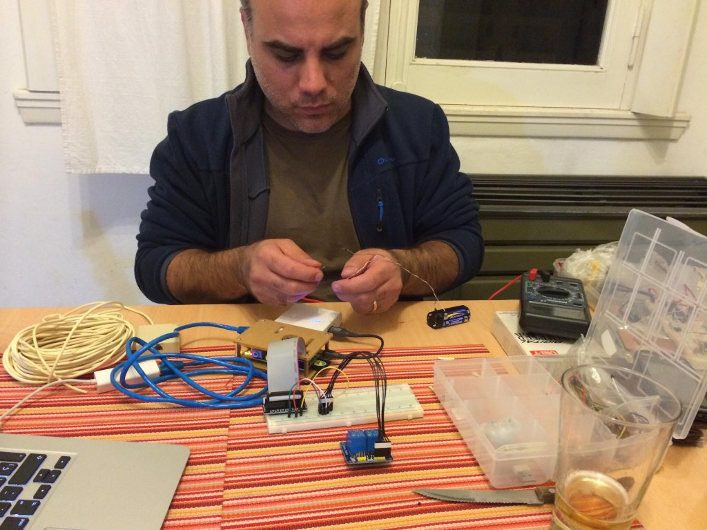

It was the year 2013 and at first it catch my attention an article that speaks about the possibilities of a “mini-computer” created in England for a scholarship program, the **Raspberry Pi**. I was interested mainly in it‘s capabilities as a _Media Center_, with the possibility of having access to all my movies and TV shows in a nice interface.

That’s when I bought my first Raspberry Pi (one of many to come), a model B. I not only installed the Media Center ([RaspBMC](https://osmc.tv/) at the beginning, then I changed to [XBian](http://www.xbian.org/)), but I also configured it as a bittorrent client. And also, thanks to the HDMI-CEC protocol, I could interact with the interface through my TV remote without any additional configuration! At this point, my Linux and terminal knowledge became sharpened, that’s because without keyboard or mouse, I had to control everything through SSH[^1].

Doing a little more research, I found out that I can do a lot more things with this little machine. I saw that thanks to the [WirePi library](http://wiringpi.com/the-gpio-utility/), I could control the state of a GPIO[^2] pin just with a console command. I then plan that I wanted to turn on a light in my house, so I read a lot about it before doing it, because I didn’t wanted to burn anything, myself included.

## And there was light…

At this point, I submerge myself directly in electronics and it principles. I learned how a relay worked and why an _optocoupler_ was necessary, for example. The emotion I felt when I wrote in the terminal `gpio write 13 1` it’s indescribable, I could turn on the light through my command line! 

I didn’t doubt about the next step. I wanted to turn on the light through a web page and turn that web page into a mobile app. I get my hands dirty and first I designed a rudimentary interface, with just a button. Then, with my PHP knowledge, I made a script to execute the terminal command. And I put everything together with an Apache server in the amazing Raspberry Pi.

That’s when I stumble upon a UX problem; What happens if the light is already on? If I wanted to turn it on outside of my house, there’s a delay, how can I indicate that to the user? How can I avoid the multiple pressing of a button? All this generated a lot more work and it was a good reminder of all the UX that a simple button requires when interacting with the user.

<figure>
  <video src="iot-1.mp4" controls poster="cover.jpg"></video>
  <figcaption>Video (in Spanish) from Apr, 2014. A long time ago!</figcaption>
</figure>

Finally, after a couple of days, the system was working, although… I wanted to go a bit further.

## Why do I want a button?

More reading and I’ve found that the Raspberry Pi has libraries to interact with Bluetooth. I bought then a little cheap BT dongle that I could connect through the USB port. I installed the libraries and I saw that I could detect the name and MAC address of any BT enabled device around. Bingo! If I could run a script that checked every five seconds, I could detect when I was close and turn on the light automatically!

But this carry other problems as well. What happens if I enter my apartment at 3pm? I didn’t need the light. Also, I wasn’t a fan of letting the script running all the time. So I thought “let’s start running it after the sun goes down”. I could fetch that piece of data through the internet, there are weather API's that report that all the time, but then, what happens if there’s no internet?

I read a bit more and that piece of data is an astronomic value that can be calculated through math, is not a weather variable. So I then installed a  [Python library](http://rhodesmill.org/pyephem/) for astronomical computations where if you could feed it with a date and a geoposition point, it gives you the exact time when the sun goes down.

After many tests with the RPi server time, calculations of what happens if I didn’t go to my house in several days, and other things, I finally let everything working. The _magical_ sensation of arriving to my apartment at night and that before opening the door the light turns on automatically, kept surprising me a long time, even after a year of having this running.

All this kept me interested in electronics and IoT, I bought a bunch more of Raspberry's and Arduinos and I participated in several hackatons about the subject.

[^1]: Computer protocol to communicate two machines typically through a console with commands
[^2]: Metal pins in the Raspberry Pi that serves as physical ways to communicate with the exterior